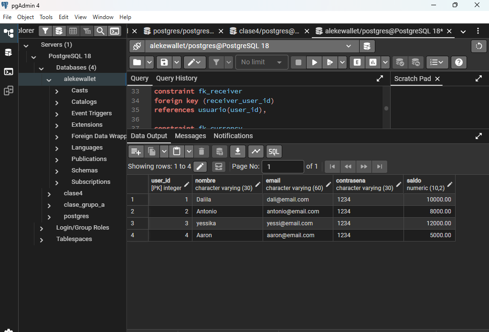
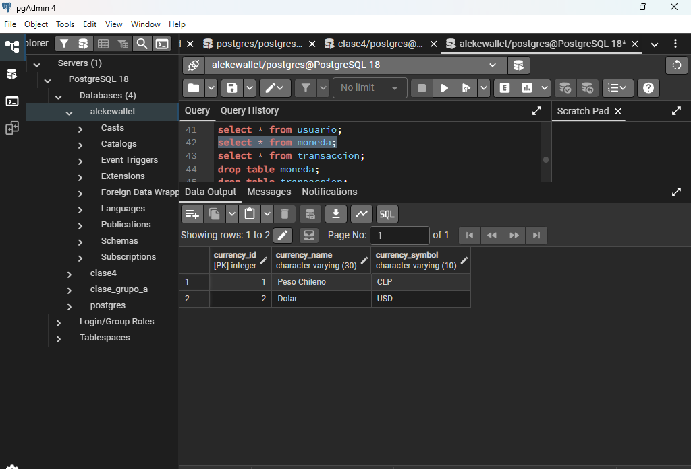
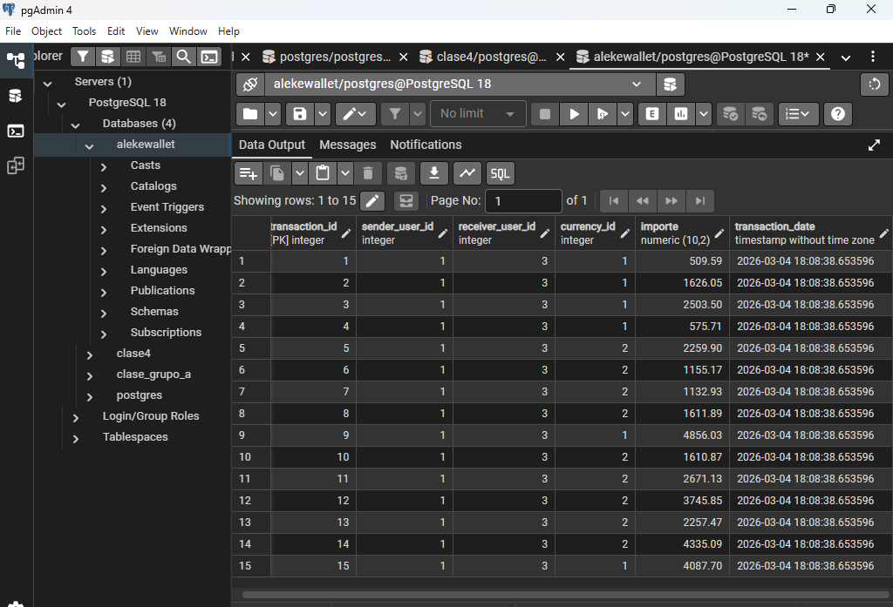
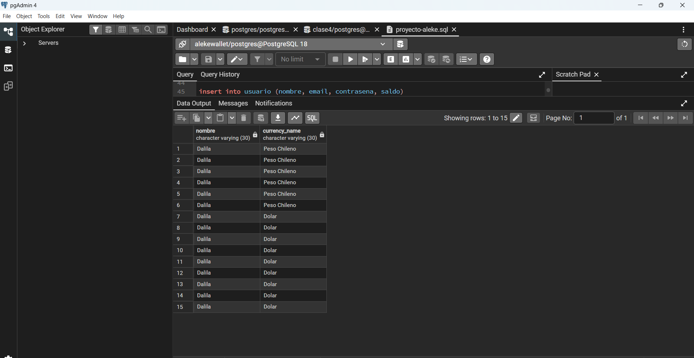
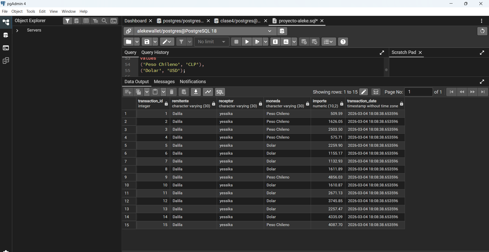
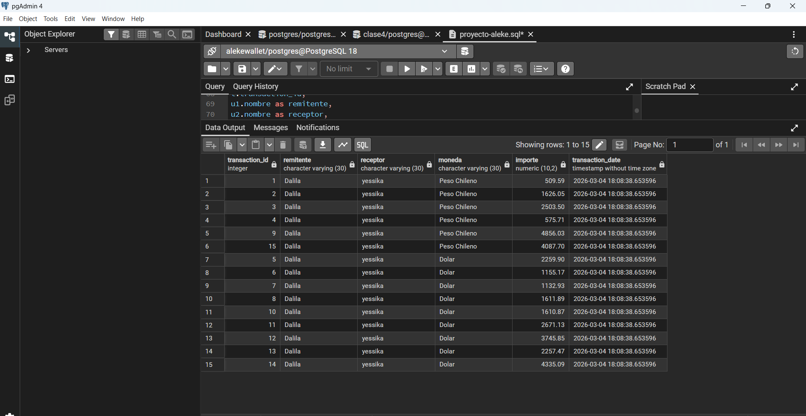

## Crear tabla usuaruio

  

##Crear tabla moneda

  

## Realizar las 15 Transferencias

  

## 1° Consulta para obtener el nombre de la moneda elegida por un usuario específico.

  

## 2° Consulta para obtener todas las transacciones registradas

  

## 3° Consulta para obtener todas las transacciones realizadas por un usuario específico

  

## 4° Actualizar correo electrónico de un usuario

  

## 5° Eliminar una transacción

  

